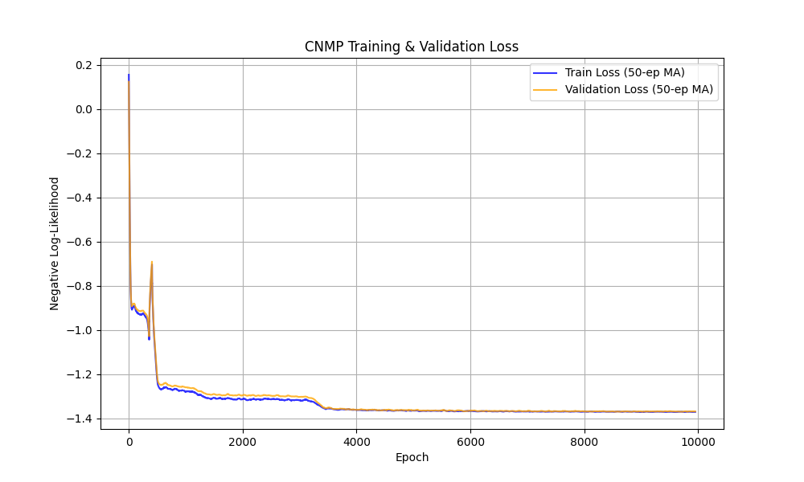
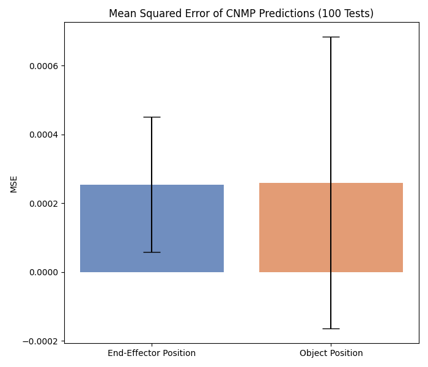

# Learning from Demonstration: Conditional Neural Movement Primitives (CNMPs)

This repository contains the implementation of a Conditional Neural Movement Primitive (CNMP) designed to learn and replicate complex Cartesian trajectories for a 7-DOF robotic arm. The robot end-effector follows randomly generated Bezier curves in the y-z plane to interact with an object of varying heights.

## Project Overview
The objective of this project is to train a CNMP to predict the continuous trajectory of both the robot's end-effector and the object.
* **Query Dimension ($t$):** Normalized time step of the trajectory.
* **Condition ($h$):** The randomly generated height of the object (fed exclusively to the decoder).
* **Target Dimensions ($Y$):** The `(y, z)` coordinates of both the end-effector and the object.

## Architecture & Training Details
* **Network:** Encoder-Decoder MLP architecture (4 hidden layers, 128 units each) utilizing ReLU activations.
* **Conditioning:** The object height ($h$) is completely decoupled from the encoder and passed directly into the decoder to condition the generalized temporal representations.
* **Optimization:** `AdamW` optimizer with a `CosineAnnealingLR` scheduler to prevent late-stage gradient overshooting.
* **Data Sampling:** Trajectories and temporal context/target points are sampled uniquely and dynamically per item in the batch to maximize gradient diversity and prevent temporal overfitting.

---

## Results & Deliverables

The model was evaluated using 100 random rollout tests. In each test, the CNMP was provided a random subset of context points and was tasked with predicting the complete physical trajectory.

### 1. Model Convergence
The Negative Log-Likelihood (NLL) loss successfully converged, demonstrating the network's ability to minimize the distributional variance of the predicted trajectories.

### 2. Prediction Accuracy (Mean Squared Error)
The final Mean Squared Error (MSE) for both the end-effector and the object, evaluated across 100 random tests. The low error rates combined with tight standard deviations indicate a highly stable and confident trajectory prediction policy.

